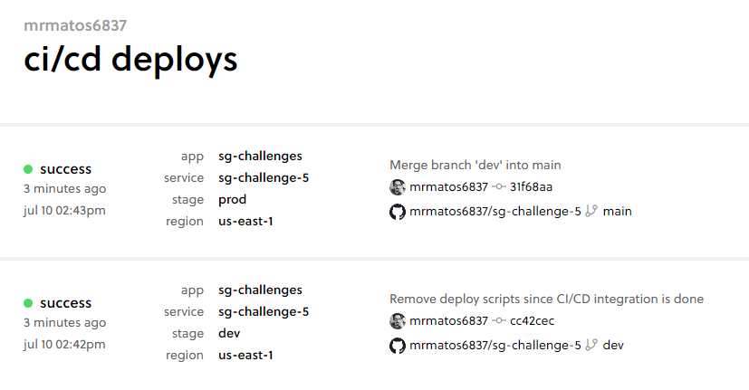
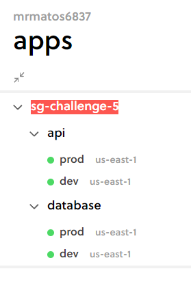
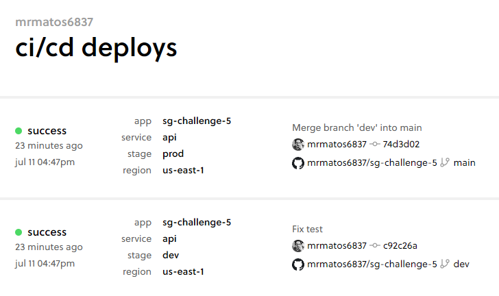

# Serverless Guru Code Challenge 5 submission

This application was built for submission to Serverless Guru, as resolution for their code challenge 5.

The challenge requires building a serverless CRUD REST api using Api-Gateway, Lambdas and DynamoDB.

[SG code challenge 5 description](challenge-description)

## Aplication Overview Video

As requested in the challenge description, here's a Loom video of me quickly going over the main points in the application structure

[Serverless Guru Code Challenge 5 Submission](https://www.loom.com/share/2b82774009ec46cca4e6317e4994d619)

## Challenge progression

As I've worked on this challenge for a couple of hours a day I've tried to quickly summarize what's been done and how much time it took on each day.

### First day

Progression:

- Initialized project
- Created CRUD Functions
- Created CRUD Routes
- Deployed application
- Tested basic use-cases

Todo:

- Build CI/CD pipeline
- Work on edge cases
- Improve HTTP responses
- Improve error handling
- Clean up
- Write tests

Time spent: 2h20m

### Second day

Progression:

- Installed jest and developed simple unit test
- Built Serverless PRO CI/CD pipeline

  

Todo:

- Work on edge cases
- Improve HTTP responses
- Improve error handling
- Clean up
- Write unit tests for the remaining functions

Time spent: 1h40m

### Third day

Progression:

- Separated api from database on different serverless.yml according to best practices

  

- Configured new CI/CD pipeline to deploy only when applications that had any changes

  

- Created helper scripts
- Created Postman collection
- Created Postman Monitor integration tests
- Improved project folder structure
- Improved Lambdas packaging
- Clean up
- Loom videos

Time spent: 1h20m + lunch break + 1h10m

### Total time spent: 6h30m
