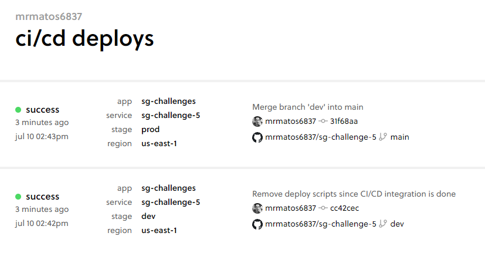

## First day

Progression:

- Initialized project
- Created CRUD Functions
- Created CRUD Routes
- Deployed application
- Tested basic use-cases

Todo:

- Build CI/CD pipeline
- Work on edge cases
- Improve HTTP responses
- Improve error handling
- Clean up
- Write tests

Time spent: 2h20m

## Second day

Progression:

- Installed jest and developed simple unit test
- Built Serverless PRO CI/CD pipeline
  

Todo:

- Work on edge cases
- Improve HTTP responses
- Improve error handling
- Clean up
- Write unit tests for the remaining functions

Time spent: 1h40m
